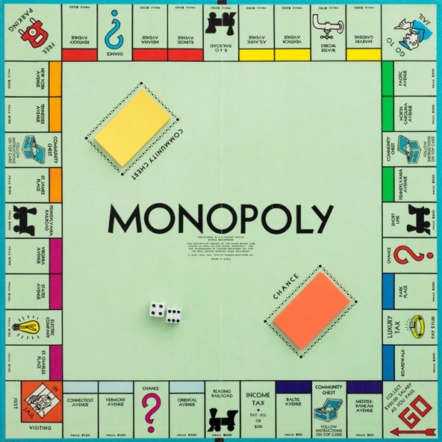

# Property Layout

## Fork Homework Repository

For each assignment in this class you will have a homework repository you should fork and clone down to your laptop.  Do your work in there and commit changes back up to your fork.  Then put in a pull request.

When you finish assignments you can submit a link to the corresponding repository in The Iron Yard Online (Tiyo).

## Instructions
* Create 4 classes you might need for monopoly (implement the 3 below)
* Populate the classes with attributes
* Make sure there are getters for the attributes
* Use constructors for attributes that shouldn't change and setters for ones that do
* Add methods to create simple logic if needed

Suggestions for classes:
* Property
	* Name
	* Price
	* Mortgage value
	* Color
	* Owned
* Player
	* Name
	* Money
	* Token
	* Method to pay money
	* Method to receive money
* Chance/Community Chest Card - Title, description

## Hard Mode
* Create an additional `Dice` class
	* It should have a method called `roll`
	* Using the [`Random` class](https://docs.oracle.com/javase/8/docs/api/java/util/Random.html) have it return a random int between 1 and 6
* Add a array of Properties
* Method to buy property that takes in an int for price and a Property for the property purchased
	* decrement the money of the player by the price
	* add the property to the array of properties
	* set the property to owned

## Resources
* [Github Repo](https://github.com/tiy-lv-java-2016-11/monopoly)

